[](https://git.io/typing-svg)

</br>
<div>
  <h2><strong>🎥 Modelagem de Banco de Dados - The Walking Dead</strong></h2>
</div>

<div align="justify">
Este projeto foi realizado no curso superior de Desenvolvimento de Sistemas Multiplataforma, especificamente durante o primeiro semestre na disciplina de Modelagem de Banco de Dados.
</div>

<div align="justify">
  
### 📋 Visão Geral
  
O objetivo principal desse projeto é demonstrar todo o conhecimento adquirido durante o semestre na disciplina de Modelagem de Banco de Dados e realizar uma Modelagem Completa, assim como é feita no dia a dia do mercado de trabalho em TI.
<div>
</div>

#

<div align="justify">

  <div align="center">
    
  ### 1 - Cenário
  
  </div>

  Você foi contratado para fazer parte de um time de desenvolvimento. Um dos projetos do time é criar um sistema para gerenciar personagens do universo "The Walking Dead". O projeto exige o cadastro detalhado dos personagens, seus refúgios, eventos em que participam e missões. Cada entidade precisa ser bem definida com seus respectivos atributos, e todas devem estar relacionadas de alguma forma. O sistema também deve incluir exemplos de todos os tipos de atributos e relacionamentos.

Personagem é uma das entidades centrais do sistema. Cada personagem é identificado por um ID, outros atributos do personagem incluem Nome, Sexo, Status, Data de Nascimento e Idade. Cada personagem pode ter múltiplas habilidades. A entidade Personagem está relacionada a várias outras entidades no sistema.

Cada Personagem está associado a um Refúgio. Um refúgio é identificado por um ID e tem atributos como Localização e Capacidade. A relação entre Personagem e Refúgio é que um refúgio pode abrigar vários personagens, mas cada personagem só pode estar em um refúgio por vez.

Além disso, os personagens participam de Eventos. O Evento é identificado por um ID e possui atributos como Nome, Descrição, Localização e Data. A participação dos personagens nos eventos é que um personagem pode participar de vários eventos e um evento pode incluir vários personagens. Esse relacionamento é gerido por uma tabela associativa Participacao_Evento, que inclui os atributos ID do Personagem e ID do Evento.

Os personagens também são designados para Missões. A Missao é identificada por um ID e tem o atributo Descricao. A relação entre Personagem e Missão é que um personagem pode participar de várias missões e uma missão pode envolver vários personagens. Este relacionamento é gerido pela tabela associativa Participacao_Missao, que inclui os atributos ID do Personagem e ID da Missao.

Cada personagem possui apenas um Inventário. O Inventário é identificado por um ID e tem o atributo Status. A relação entre Inventario e Equipamento é que um inventário pode ter muitos equipamentos, mas cada equipamento pertence a um único inventário. A entidade Equipamento é identificada por um ID e possui atributos como Nome, Tipo e Condição. 
</div>

#

<div align="center">
  
  ### 2 - Modelagem Conceitual

  

</div>

  #

<div align="center">
  
  ### 3 - Modelagem Lógica

  

</div>

#

<div align="justify">
  
  

  <div align="center">
    
  ### 4 - Modelagem Física  
  
  </div>

  Criando o banco de dados:

  ```sql
CREATE DATABASE twd;
  ```

Criando as tabelas:
```sql
USE twd;
CREATE TABLE Refugio (
    id_refugio INT PRIMARY KEY AUTO_INCREMENT,
    estado_refugio VARCHAR(2),
    lugar_refugio VARCHAR(15),
    capacidade INT
);

CREATE TABLE Evento (
    id_evento INT PRIMARY KEY AUTO_INCREMENT,
    nome_evento VARCHAR(30),
    descricao_evento VARCHAR(255),  
    estado_evento VARCHAR(2),
    lugar_evento VARCHAR(15),
    data_evento DATE
);

CREATE TABLE Missao (
    id_missao INT PRIMARY KEY AUTO_INCREMENT,
    descricao_missao VARCHAR(255)
);

CREATE TABLE Inventario (
    id_inventario INT PRIMARY KEY AUTO_INCREMENT,
    status_inventario VARCHAR(15)
);

CREATE TABLE Equipamento (
    id_equipamento INT PRIMARY KEY AUTO_INCREMENT,
    nome_equipamento VARCHAR(25),
    tipo VARCHAR(15),
    condicao VARCHAR(10),
    inventario_id INT,
    FOREIGN KEY (inventario_id) REFERENCES Inventario(id_inventario)
);

CREATE TABLE Personagem (
    id_personagem INT PRIMARY KEY AUTO_INCREMENT,
    nome_personagem VARCHAR(60),
    sexo VARCHAR(1),
    status_personagem VARCHAR(12),
    data_nasc DATE,
    idade INT GENERATED ALWAYS AS (YEAR('2024-06-09') - YEAR(data_nasc) - 
    IF(DATE_FORMAT('2024-06-09', '%m%d') < DATE_FORMAT(data_nasc, '%m%d'), 1, 0)) STORED,
    refugio_id INT,
    inventario_id INT,
    FOREIGN KEY (refugio_id) REFERENCES Refugio(id_refugio),
    FOREIGN KEY (inventario_id) REFERENCES Inventario(id_inventario)
);

CREATE TABLE Habilidade (
    id_habilidade INT PRIMARY KEY AUTO_INCREMENT,
    descricao VARCHAR(25),
    personagem_id INT,
    FOREIGN KEY (personagem_id) REFERENCES Personagem(id_personagem)
);

CREATE TABLE Personagem_Evento (
    personagem_id INT,
    evento_id INT,
    FOREIGN KEY (personagem_id) REFERENCES Personagem(id_personagem),
    FOREIGN KEY (evento_id) REFERENCES Evento(id_evento)
);

CREATE TABLE Personagem_Missao (
    personagem_id INT,
    missao_id INT,
    FOREIGN KEY (personagem_id) REFERENCES Personagem(id_personagem),
    FOREIGN KEY (missao_id) REFERENCES Missao(id_missao)
);
```
  

</div>

#

<div align="justify">
  <div align="center">
    
  ### 5 - Inserção de Dados
  
  </div>

  ```sql
INSERT INTO Refugio(estado_refugio, lugar_refugio, capacidade)
VALUES ('VA', 'Alexandria', 50),
('VA', 'Hilltop', 30), ('VA', 'Kingdom', 50), 
('VA', 'Santuário', 90), ('VA', 'Oceanside', 20),
('GA', 'Woodbury', 55), ('GA', 'Prisão', 40), 
('GA', 'Terminus', 25), ('GA', 'Grimes Compound', 50),
('GA', 'Whisperers Camp', 20), ('GA', 'Casa da Fazenda', 25), 
('GA', 'CDC', 50), ('VA', 'Junkyard', 15),
('VA', 'Fábrica', 20), ('GA', 'Plaza', 10),
('GA', 'Vila', 30), ('GA', 'Outpost', 35),
('GA', 'Cabin', 15), ('VA', 'Forte', 40),
('GA', 'Porto', 20);

INSERT INTO Evento(nome_evento, descricao_evento, estado_evento, lugar_evento, data_evento)
VALUES ('Ataque ao Santuário', 'Grande ataque ao refúgio Santuário', 'VA', 'Santuário', '2017-12-10'),
('Batalha de Alexandria', 'Confronto entre comunidades', 'VA', 'Alexandria', '2018-02-25'),
('Missão ao CDC', 'Busca por informações no CDC', 'GA', 'CDC', '2010-12-05'),
('Resgate de Maggie', 'Resgate de Maggie em Hilltop', 'VA', 'Hilltop', '2016-04-24'),
('Defesa do Kingdom', 'Defesa do refúgio Kingdom', 'VA', 'Kingdom', '2017-10-22'),
('Evacuação da Fazenda', 'Evacuação da fazenda do Hershel', 'GA', 'Casa da Fazenda', '2012-02-26'),
('Retirada de Terminus', 'Retirada do grupo do Terminus', 'GA', 'Terminus', '2014-10-12'),
('Reunião em Oceanside', 'Reunião de líderes em Oceanside', 'VA', 'Oceanside', '2018-04-22'),
('Expansão de Woodbury', 'Expansão do território de Woodbury', 'GA', 'Woodbury', '2013-05-12'),
('Fortificação da Prisão', 'Fortificação das defesas da prisão', 'GA', 'Prisão', '2013-11-17'),
('Batalha Final', 'Confronto final contra os Sussurradores', 'GA', 'Whisperers Camp', '2019-03-31'),
('Retomada de Alexandria', 'Retomada do controle de Alexandria', 'VA', 'Alexandria', '2019-07-21'),
('Aliança de Hilltop', 'Formação de aliança em Hilltop', 'VA', 'Hilltop', '2017-11-05'),
('Cerco ao Forte', 'Cerco ao forte dos Salvadores', 'VA', 'Forte', '2018-11-04'),
('Descoberta do Porto', 'Descoberta de novo local no Porto', 'GA', 'Porto', '2018-01-21'),
('Libertação do Junkyard', 'Libertação do grupo do Junkyard', 'VA', 'Junkyard', '2018-03-18'),
('Fuga do Outpost', 'Fuga do posto avançado dos Sussurradores', 'GA', 'Outpost', '2017-08-20'),
('Reunião do Conselho', 'Reunião de líderes em Hilltop', 'VA', 'Hilltop', '2018-06-25'),
('Colapso do Plaza', 'Destruição do refúgio Plaza', 'GA', 'Plaza', '2017-07-25'),
('Incursão na Vila', 'Incursão dos Salvadores na Vila', 'GA', 'Vila', '2017-09-10');

INSERT INTO Missao(descricao_missao)
VALUES ('Busca por suprimentos'),
('Resgate de reféns'), ('Exploração de área'), 
('Defesa do território'), ('Busca por medicamentos'),
('Construção de defesas'), ('Treinamento de combate'), 
('Patrulha de fronteiras'), ('Expansão de território'),
('Fortificação de acampamento'), ('Incursão ao território inimigo'), 
('Busca por aliados'), ('Recuperação de recursos'),
('Expansão do refúgio'), ('Resgate de membros'), 
('Construção de abrigo'), ('Manutenção de equipamento'),
('Treinamento de novos recrutas'), ('Exploração de novas áreas'), 
('Fortificação de fronteiras');

INSERT INTO Inventario(status_inventario)
VALUES ('Em uso'),
('Em uso'), ('Em uso'), 
('Recolhido'), ('Em uso'),
('Em uso'), ('Alocado'), 
('Em uso'), ('Recolhido'),
('Alocado'), ('Em uso'), 
('Alocado'), ('Recolhido'),
('Em uso'), ('Em uso'), 
('Alocado'), ('Em uso'),
('Alocado'), ('Em uso'), 
('Inacessível'), ('Em uso'),
('Inacessível'), ('Em uso'), 
('Em uso'), ('Em uso');

INSERT INTO Equipamento(nome_equipamento, tipo, condicao, inventario_id)
VALUES ('Pistola', 'Arma', 'Boa', 1),
('Besta', 'Arma', 'Boa', 2), ('Katana', 'Arma', 'Excelente', 3), 
('Mochila', 'Suprimento', 'Média', 4), ('Rifle', 'Arma', 'Boa', 5),
('Rádio', 'Comunicação', 'Boa', 6), ('Facão', 'Arma', 'Boa', 7), 
('Taco de Beisebol', 'Arma', 'Média', 8), ('Kit de Primeiros Socorros', 'Suprimento', 'Boa', 9),
('Binóculos', 'Ferramenta', 'Média', 10), ('Rádio CB', 'Comunicação', 'Boa', 11), 
('Pistola', 'Arma', 'Boa', 12), ('Fuzil', 'Arma', 'Boa', 13),
('Bíblia', 'Suprimento', 'Boa', 14), ('Bússola', 'Ferramenta', 'Boa', 15), 
('Mochila', 'Suprimento', 'Média', 16), ('Medicamentos', 'Arma', 'Boa', 17),
('Facas de Arremesso', 'Arma', 'Boa', 18), ('Pistola', 'Arma', 'Boa', 19), 
('Espada', 'Arma', 'Boa', 20), ('Faca', 'Arma', 'Boa', 1), ('Faca', 'Arma', 'Média', 2);

INSERT INTO Personagem(nome_personagem, sexo, status_personagem, data_nasc, refugio_id, inventario_id)
VALUES ('Rick Grimes','M','Vivo','1976-09-14', 1, 1),
('Daryl Dixon','M','Vivo','1969-04-06', 1, 2),
('Michonne','F','Vivo','1975-08-23', 1, 3),
('Glenn Rhee','M','Morto','1983-03-19', 1, 4),
('Carol Peletier','F','Vivo','1965-01-13', 1, 5),
('Maggie Greene','F','Vivo','1988-12-10', 1, 6),
('Carl Grimes','M','Morto','2002-06-27', 1, 7),
('Negan','M','Vivo','1968-04-04', 4, 8),
('Hershel Greene','M','Morto','1946-11-17', 11, 9),
('Sasha Williams','F','Morto','1982-01-29', 1, 10),
('Eugene Porter','M','Vivo','1970-02-22', 1, 11),
('Rosita Espinosa','F','Morto','1986-11-30', 1, 12),
('Abraham Ford','M','Morto','1964-12-28', 1, 13),
('Gabriel Stokes','M','Vivo','1962-04-11', 1, 14),
('Aaron','M','Vivo','1982-05-14', 1, 15),
('Tara Chambler','F','Morto','1985-07-23', 1, 16),
('Enid','F','Vivo','2000-05-28', 1, 17),
('Jesus (Paul)','M','Morto','1981-09-25', 2, 18),
('Dwight','M','Vivo','1973-12-05', 4, 19),
('Beta','M','Morto','1968-07-22', 10, 20),
('Lydia','F','Vivo','2001-09-08', 10, 21),
('Alpha','F','Morto','1970-12-17', 10, 22),
('Ezekiel','M','Vivo','1972-10-03', 3, 23),
('Judith Grimes','F','Vivo','2011-06-20', 1, 24),
('Yumiko','F','Vivo','1985-03-05', 1, 25);

INSERT INTO Habilidade(descricao, personagem_id)
VALUES ('Liderança', 1),
('Primeiros socorros', 9), ('Sobrevivência na selva', 2),
('Tiro ao alvo', 1), ('Rastreamento', 2),
('Negociação', 6), ('Furtividade', 3),
('Construção', 13), ('Cozinha', 7),
('Estratégia de combate', 1), ('Sobrevivência urbana', 4),
('Natação', 16), ('Culinária improvisada', 5),
('Defesa pessoal', 3), ('Orientação', 9),
('Raciocínio rápido', 11), ('Comunicação por rádio', 11),
('Conhecimento em armamento', 9), ('Medicina veterinária', 9),
('Montanhismo', 2);

INSERT INTO Personagem_Evento(personagem_id, evento_id)
VALUES (1, 1),
(2, 1), (3, 1),
(12, 2), (11, 2),
(10, 2), (11, 3),
(12, 3), (13, 3),
(1, 4), (2, 4),
(18, 4), (18, 5),
(23, 5), (5, 5),
(4, 6), (5, 6),
(6, 6), (1, 7),
(4, 7);

INSERT INTO Personagem_Missao(personagem_id, missao_id) VALUES (1, 1),
(2, 1), (1, 2),
(8, 2), (5, 3),
(6, 3), (10, 4),
(11, 4), (4, 5),
(12, 5), (13, 6),
(15, 6), (14, 7),
(16, 7), (7, 8),
(17, 8), (2, 9),
(7, 9), (20, 10),
(21, 10);
  ```

</div>

#

<div align="justify">
  <div align="center">
    
  ### 6 - CRUD
  
  </div>

Create(insert):
  ```sql
INSERT INTO Inventario(status_inventario) VALUES ('Inacessível');
INSERT INTO Personagem(nome_personagem, sexo, status_personagem, data_nasc, refugio_id, inventario_id)
VALUES ('Morgan Jones','M','Vivo','1970-02-20', 3, 26);
  ```
Resultado:

Antes:

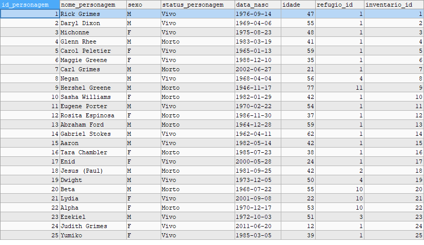

Depois:

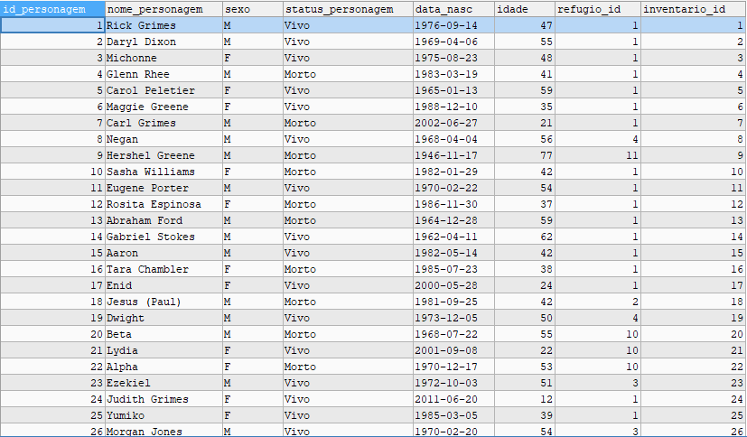

Read(select):
```sql
SELECT * FROM Personagem WHERE id_personagem = 26;
 ``` 

Resultado:

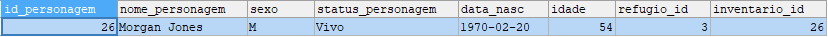

Update:
```sql
UPDATE Personagem SET status_personagem = 'Desaparecido' WHERE id_personagem = 26;
```  

Resultado:

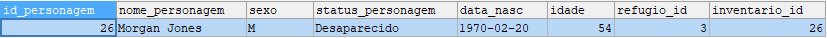

Delete:
```sql
DELETE FROM Personagem WHERE id_personagem = 26;
 ``` 

Resultado:


</div>

#

<div align="justify">
  <div align="center">
    
  ### 7 - Relatórios
  
  </div>

  Consulta 1: Selecionar todos os personagens e seus respectivos refúgios
```sql
SELECT Personagem.nome_personagem, Refugio.lugar_refugio FROM Personagem, Refugio
WHERE Personagem.refugio_id = Refugio.id_refugio;
  ```

Resultado:

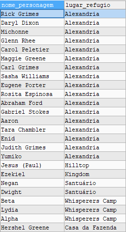

  Consulta 2: Selecionar todos os personagens com suas habilidades.
```sql
SELECT Personagem.nome_personagem, Habilidade.descricao FROM Personagem, Habilidade
WHERE Personagem.id_personagem = Habilidade.personagem_id;
  ```

Resultado:

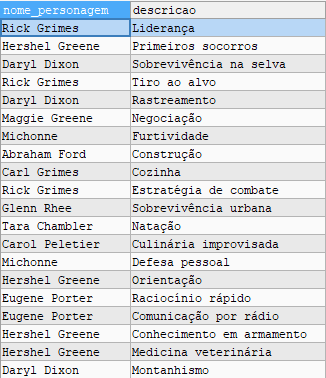

  Consulta 3: Selecionar todos os personagens e eventos em que participaram.
```sql
SELECT Personagem.nome_personagem, Evento.nome_evento FROM Personagem, Evento, Personagem_Evento
WHERE Personagem_Evento.personagem_id = Personagem.id_personagem AND Personagem_Evento.evento_id = Evento.id_evento;
```

Resultado:

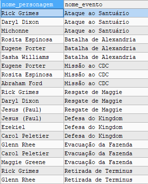

  Consulta 4: Listar personagens e a quantidade de missões que participaram, ordenados por quantidade de missões. 
```sql
SELECT Personagem.nome_personagem, COUNT(Personagem_Missao.missao_id) AS numero_missoes FROM Personagem, Personagem_Missao, Missao
WHERE Personagem.id_personagem = Personagem_Missao.personagem_id AND Personagem_Missao.missao_id = Missao.id_missao
GROUP BY Personagem.nome_personagem ORDER BY numero_missoes DESC;
```

Resultado:

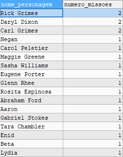

  Consulta 5: Listar personagens que têm mais de um equipamento.
```sql
SELECT Personagem.nome_personagem, Equipamento.nome_equipamento FROM Personagem, Inventario, Equipamento WHERE 
Personagem.inventario_id = Inventario.id_inventario AND Equipamento.inventario_id = Inventario.id_inventario AND
Inventario.id_inventario IN (
    SELECT inventario_id
    FROM Equipamento
    GROUP BY inventario_id
    HAVING COUNT(*) > 1
);
```

Resultado:

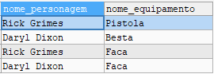

  Consulta 6: Listar personagens que possuem uma determinada condição de equipamento.
```sql
SELECT Personagem.nome_personagem, Equipamento.nome_equipamento, Equipamento.condicao FROM Personagem, Equipamento, Inventario 
WHERE Equipamento.condicao = 'Boa' AND Personagem.inventario_id = Inventario.id_inventario
AND Equipamento.inventario_id = Inventario.id_inventario;
```

Resultado:

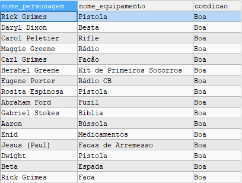

  Consulta 7: Selecionar personagens e equipamentos que possuem.
```sql
SELECT Personagem.nome_personagem, Equipamento.nome_equipamento FROM Personagem, Equipamento, Inventario WHERE
 Inventario.id_inventario = Personagem.inventario_id AND Equipamento.inventario_id = Inventario.id_inventario;
```

Resultado:

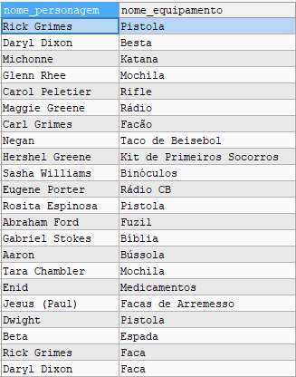

  Consulta 8: Selecionar personagens vivos e seus refúgios.
```sql
SELECT Personagem.nome_personagem, Personagem.status_personagem, Refugio.lugar_refugio FROM Personagem, Refugio WHERE
 status_personagem = 'Vivo' AND Personagem.refugio_id = Refugio.id_refugio;
```
  
Resultado:

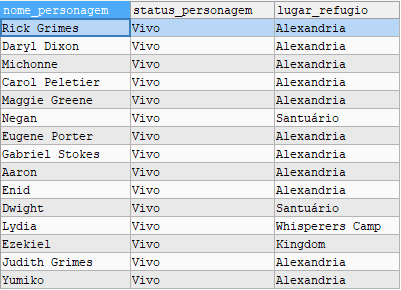

  Consulta 9: Selecionar refúgios e a contagem de personagens em cada um.
```sql
SELECT Refugio.lugar_refugio, COUNT(Personagem.id_personagem) AS qtde_pessoas FROM Refugio
LEFT JOIN Personagem ON Refugio.id_refugio = Personagem.refugio_id GROUP BY Refugio.lugar_refugio;
```

Resultado:

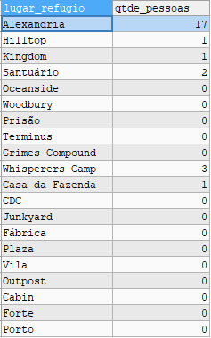

  Consulta 10: Listar personagens de acordo com a data de nascimento em ordem decrescente.
```sql
SELECT Personagem.nome_personagem, Personagem.data_nasc FROM Personagem ORDER BY data_nasc DESC; 
```

Resultado:

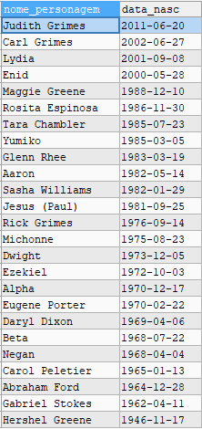

</div>

#


